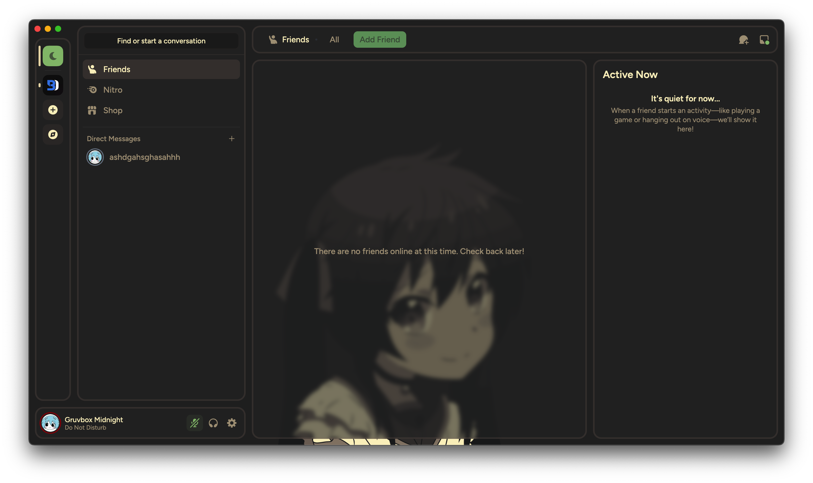
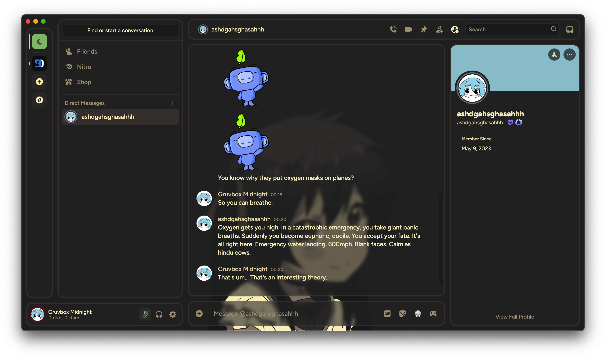

<h1 align="center">Gruvbox Midnight 🌙</h1>

Gruvbox Midnight is a theme for your Discord client that combines the best elements of the popular [Midnight](https://github.com/refact0r/midnight-discord/tree/91c52e4d056f1b2502ebb3709abb59924f0543a4) and [Radial Status](https://github.com/DiscordStyles/RadialStatus/tree/e361ae760dd8b88f6c187efa11a83e9aea3afd83) themes.


<h2 align="center">Installing </h2>

### 🐧 For Linux Users

```bash
# Navigate to BetterDiscord themes folder
cd ~/.config/BetterDiscord/themes/
# Download the theme
wget https://raw.githubusercontent.com/ashdgahsghasahhh/Gruvbox-Midnight/main/Gruvbox.Midnight.theme.css
```

### 🪟 For Windows Users
1. Download the theme file:
[Gruvbox.Midnight.theme.css](https://raw.githubusercontent.com/ashdgahsghasahhh/Gruvbox-Midnight/main/Gruvbox.Midnight.theme.css)  
3. Copy it to BetterDiscord themes folder:  
   `%appdata%\BetterDiscord\themes`  

## 🔄 Updating
### Linux users
```bash
cd ~/.config/BetterDiscord/themes/
rm Gruvbox.Midnight.theme.css  # Remove old version
wget https://raw.githubusercontent.com/ashdgahsghasahhh/Gruvbox-Midnight/main/Gruvbox.Midnight.theme.css
```
For Windows: Re-download and replace the theme file.
## 🛠️ Troubleshooting
- **Theme not showing?**  
  Make sure file has `.theme.css` extension
- **Visual glitches?**  
  Disable other themes and restart Discord
- **Still stuck?**  
  [Open an issue](https://github.com/ashdgahsghasahhh/Gruvbox-Midnight/issues) - I'll help! 🤝
## 💖 Enjoying the Theme?
- Star the repo ⭐
- Share with friends
- Contribute improvements!
## 📜 Credits
Special thanks to:
- [Midnight](https://github.com/refact0r/midnight-discord) for the base inspiration
- [Radial Status](https://github.com/DiscordStyles/RadialStatus) for status indicators
- [Gruvbox color palette creators](https://github.com/morhetz/gruvbox)
